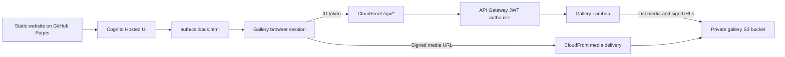

# Everyday Lilly

Static website and private family photo vault for [www.everydaylilly.com](https://www.everydaylilly.com/), plus companion microsites and the vault's AWS backend source.

Architecture and live AWS configuration reviewed on **2026-09-10 (Europe/Sofia)**. The backend is deployed, not a future scaffold. The Flutter source described in older documentation is **not present in this checkout**.

## Grandma privacy and chronological albums — 2026-09-21

Grandma uploads are visible only to members of the `grandma` role. Viewer and admin accounts without that role receive neither originals nor preview URLs for these photos. Grandma can still switch between her own photos and all media she is authorized to see, including the family album.

New uploads require a known capture date. Dated camera filenames prefill it; otherwise the uploader must enter a date they know or remove the file. Grandma’s upload destination is calculated from monthly anniversaries; family uploads must match the selected month. Invalid, pre-birth, future and conflicting dates are rejected by the API. Sorting uses capture dates and times, never file modification or S3 upload dates. Existing undated legacy media keeps deterministic filename ordering; no capture date is invented for it.

The corrected import retains only verified capture dates, with private originals and derivatives moved to new paths. Old shared paths are removed and their CloudFront caches invalidated. S3 version history remains available for recovery; already downloaded browser copies cannot be recalled. Exact media counts, identifiers, filenames and per-file correction receipts stay outside Git.

Validation: 41 JavaScript regressions cover role isolation, date validation, capture-time ordering and upload controls. Synthetic phone testing covers blocked unknown dates, automatic month assignment and a complete confirmed-date upload.

## Grandma's personal album — 2026-09-20

Members of the `grandma` Cognito group open `/gallery/grandma/` after login: a birthday keepsake page with a photo collage, a personal/family album switch, larger mobile photo tiles and phone uploads. The personal view includes only media attributed by the backend to that account. The privacy policy above supersedes the initial family-wide sharing behavior. Existing viewer, admin and test routing remains distinct.

New grandma uploads are stored under `months/grandma/<month>/by/<contributor>/<dated-filename>`; administrator uploads use `months/<month>/by/<contributor>/<dated-filename>`. The contributor is derived from the authenticated Cognito subject on the server; clients cannot choose another owner. `GET /api/gallery/manifest?scope=mine` provides a separate, always-current personal manifest. The default family manifest includes per-request `isMine` flags so switching views reuses the authorized in-memory response. No family photos, account identifiers or signed URLs are stored in this repository.

HEIC/HEIF uploads now keep their originals in private S3 and generate both a full-resolution JPEG for viewing and a small thumbnail. Camera/location metadata is removed from derivatives. Files awaiting conversion are omitted from the display list and counted as pending. Grandma can upload photos to her own namespace, but cannot change month covers or upload movies. The birthday import excludes movies; the animated lily pond remains the background.

Validation: 32 JavaScript tests, eight worker tests, desktop/mobile synthetic browser checks including a complete HEIC upload flow, and live Lambda/S3/CloudFront checks. The latter verify ownership filtering, the initial sharing behavior, checksums, decoded display images and signed/unsigned access boundaries; they are not a browser login using the grandmother's password. See the [backend runbook](app/backend/README.md) for deployment and test dependencies.

## Gallery polish and stored previews — 2026-09-11

Empty months have faded numerals, a subtle blur and an outlined marker; they remain selectable for uploads. A small horizontal growth carousel sits below the month selector, ordered from the first month to the last. Capture dates determine chronological order; the correction above removes the former modification-date fallback. Swipe, scroll, arrow buttons and keyboard navigation are supported, and tapping a frame opens the original in the viewer.

The album uses original water-lily artwork, a gold underline, and a curved golden trail through the growth ribbon. Selected months and the current ribbon photo receive a gold accent; desktop photos gently zoom on hover. The full-page background is a calm jade pond with floating lily pads, pale pink blossoms, expanding ripples, soft reflections and tiny firefly glows. It reuses one small cached SVG and CSS transform/opacity animations, with no video, animation library or API polling. Decoration stays behind controls, pauses in hidden tabs and is removed for reduced-motion preferences; fewer lilies appear on mobile.

The growth ribbon glides automatically at 96 CSS pixels per second, rests briefly at either end, and reverses without duplicating photos. Warm light, tiny golden stars and lightly tilted photo cards give it a storybook feel. The wheel plays automatically without a play/stop control. Hovering anywhere over the ribbon pauses it at the exact position; moving the pointer outside resumes immediately, even after clicking an arrow or photo. Manual touch/keyboard navigation resumes after a short delay. Retained mouse focus cannot leave it stuck. Motion is suspended while a photo is open, during upload selection, and when the ribbon or tab is hidden. Reduced-motion preferences disable autoplay and decorative animation. The animation makes no API calls and reuses the existing cached previews. Hover behavior follows the interaction pattern documented by [Embla Auto Scroll](https://www.embla-carousel.com/docs/v8/plugins/auto-scroll) and [W3C carousel guidance](https://www.w3.org/WAI/tutorials/carousels/animations/).

The selected-month grid now uses four desktop columns and three mobile columns, with short entrance animations and reduced-motion support. Its upload destination remains the selected month, and the upload heading shows that month's inclusive date range. Dates are anchored to the private timeline start supplied by the authorized manifest, not to upload timestamps.

Video tiles use stored JPEG posters instead of asking the browser to decode a video. A new S3-triggered Lambda generates private previews up to 640 pixels for monthly photos and videos. The manifest signs these preview URLs separately; the grid and growth strip lazy-load them, while the viewer opens originals. Immutable content-based keys preserve cache hits. New uploads trigger generation automatically, with a bounded metadata refresh after upload.

Production backfill completed for all 455 existing media objects, including eight videos. S3 key, size and ETag comparisons confirmed all originals were unchanged. The entire preview set is about 14.7 MB. Authorized live checks returned every original with a preview; all eight video posters returned JPEGs, and unsigned preview access returned 403.

The [backend runbook](app/backend/README.md) describes the isolated AWS deployment and the Terraform state imports required before a future full apply. The manifest signer now parses its key once per warm runtime and has additional CPU capacity for signing original and preview URLs; the final live request completed in 2.88 seconds. Existing signing keys and gallery access rules are retained.

Validation: 15 JavaScript regression tests, five Python worker tests, syntax/format checks, desktop/mobile browser checks, and live S3/API checks. Browser layout checks used clearly labeled synthetic media; private family media was not sent to design tools.

## Monthly family album — 2026-09-10

The gallery now opens directly into one month, with a warm ivory/green album layout, a 12-month selector, and a five-year switcher. It restores the last selected month for the current account; a new account starts at the latest populated month (or Month 1 for an empty album). `?month=1` through `?month=60` links override the remembered selection.

- The main grid renders only the selected month's media, including existing cover images; the growth strip above it spans the album. Navigating months reuses the authorized manifest in memory and does not call the API again.
- Admins select or drop multiple files, review their filenames/previews and destination month, then confirm the batch. There is no required cover-photo step. The first regular photo can represent the month, and existing dedicated covers remain visible.
- The destination is locked while files are queued/uploading. Completed batches stay in that month; duplicate filenames are skipped, successful files appear after one manifest refresh, and only failed files remain for retry.
- A new page visit checks authorization with the backend. Signed manifests are no longer persisted in browser storage. Auth session changes clear legacy caches, and logout/account-change events remove the open gallery in other tabs. Each API action reacquires a valid session.
- Media URLs stay stable when refreshing metadata or finishing uploads, preserving browser/CloudFront cache hits. The stored-preview update above replaces the original browser-decoded video approach. Originals remain available in the viewer.
- HEIC/HEIF is supported as of the personal-album update above. Untouched originals stay private in S3; the browser displays generated JPEGs.

[Figma design direction](https://www.figma.com/design/uS7zZItz2W003PrCbyu8G9?node-id=2-2) uses an empty album state and contains no private family photos.

Validation: `node --test tests/gallery.test.cjs` (11 tests), JavaScript syntax checks, and `git diff --check` passed. Local browser checks used synthetic media and a loopback-only API fixture: desktop/mobile layout, selected-month-only images, zero extra manifest calls for month changes, year/month boundaries, selection persistence, batch upload, partial-failure retry, duplicate skip, viewer/denied/test states, and the photo viewer were checked. The mobile check at 390×844 had no horizontal overflow. AWS now reports the owner-supplied account in `admin`; no account details are retained here.

GitHub Pages publishes the repository root from `main`; this release includes the album CSS and updated auth/gallery scripts together. No Terraform apply is required for these frontend changes. Real S3 upload behavior was not re-tested by writing production family media. The backend's long-lived signed-URL/revocation finding below remains unresolved.

Historical video-preview follow-up: the browser-decoded approach passed synthetic MP4 checks but did not consistently display the owner's videos. The stored JPEG preview deployment above supersedes it.

## Where the backend lives

**Terraform manages a serverless AWS stack in Frankfurt (`eu-central-1`). The website uses Cognito directly; it does not use Amplify.**

| Part | Implementation | Source |
| --- | --- | --- |
| Public website and gallery HTML | Static GitHub Pages hosting | Root HTML/CSS/JS, `CNAME`, `gallery/` |
| Vault sign-in | Amazon Cognito Hosted UI, OAuth authorization code with PKCE | `auth/auth.js`, `auth/callback.html`, root `script.js` |
| Gallery API | API Gateway HTTP API with JWT authorization | `app/backend/live/prod/gallery_api.tf` |
| Backend application code | Node.js 22 Lambda, `everyday-lilly-vault-prod-gallery-manifest` | `app/backend/live/prod/lambda/gallery_manifest/index.mjs` |
| Preview generation | Python 3.12 Lambda with FFmpeg, triggered by monthly S3 uploads | `app/backend/live/prod/gallery_thumbnails.tf` |
| Private media delivery | CloudFront signed URLs and a private S3 gallery bucket | `app/backend/live/prod/main.tf` |
| Long-term originals | Separate private S3 archive bucket with Deep Archive lifecycle | `app/backend/live/prod/main.tf` |
| Infrastructure | Terraform, AWS/archive/random providers | `app/backend/live/prod/` |

Live DNS points `www` at GitHub Pages, and the website responds with `Server: GitHub.com`. AWS reads confirmed the gallery distribution, API routes, Lambda, Cognito configuration, and both buckets. No Everyday Lilly Amplify app was returned in the checked region, and no Amplify integration was found in this repository. This was not an all-region account inventory.



The archive bucket is separate from this gallery path. There is no database resource or persistent application server in this Terraform stack; the gallery manifest is built from S3 objects.

## Vault login and access

1. Open **Sign In** on the [homepage](https://www.everydaylilly.com/). The modal collects an email and opens Cognito in a popup for password entry and recovery.
2. `auth/callback.html` exchanges the authorization code using PKCE. The auth helper saves the session in `sessionStorage`, or `localStorage` when “Keep this device signed in” is selected.
3. The gallery requests `GET /api/gallery/manifest` through CloudFront using a Cognito **ID token**. API Gateway validates the JWT; Lambda checks the account's gallery role and chooses its collection.
4. CloudFront serves media using the signed URLs returned in the manifest. Signing in does not make the S3 bucket public.

| Cognito group | Collection | Upload access |
| --- | --- | --- |
| `admin` | `/gallery/months/` | Yes |
| `viewers` | `/gallery/months/` | No |
| `test` | `/gallery/test/` | No, unless independently an admin |
| No permitted role or test claim | Denied by the backend | No |

The Lambda also recognizes `admins`/`viewer` aliases and supported test claims; see the [backend runbook](app/backend/README.md). A test designation takes precedence for collection routing. An account name containing “admin” grants no permissions. User creation and group assignment are separate operations.

The monthly gallery has 60 slots across five years. Display labels are months 1–60; new upload paths use internal month IDs 0–59. Admin upload tiles are inside month detail views. The test gallery supports media filters.

## Review findings — 2026-09-10

- **Initial review: supplied-account access was blocked (membership subsequently fixed by the owner).** AWS confirmed the reviewed account is enabled and `CONFIRMED`, with no Cognito group memberships. The browser reached the gallery and displayed “This account is not assigned to a gallery role.” A permitted group must be assigned intentionally, followed by a fresh sign-in. Account details and credentials are not stored here. No role changes were made.
- **Fixed locally in the monthly album update: manifest cache crossed account boundaries.** `gallery/app.js` caches manifests for one hour in `localStorage`, keyed only by collection, and can return them before contacting the backend. Logout clears auth storage but leaves this cache. A subsequent account on the same browser can receive the previous account's media URLs and admin UI state. Upload authorization still runs on the backend. Scope cached data to the user, clear it on logout/account changes, and revalidate authorization before displaying it. This finding comes from source inspection; a two-account reproduction was not performed.
- **Media access can outlast a session.** Lambda clamps the signing window to at least one year and rounds expiry to the next window boundary. Remaining URL validity varies within that window; logout does not revoke already-issued URLs. The browser also receives a one-year immutable media cache policy. Shortening URL validity requires changing the Lambda clamp as well as Terraform configuration; already-cached media cannot be recalled.
- **WAF documentation was stale.** Current Terraform contains no WAF resources; the regional AWS WAF ACL listing was empty. Do not claim an active custom CAPTCHA or WAF rate-blocking layer. Cognito username-existence suppression is enabled.
- **Production apply prerequisites are missing locally.** This checkout has no production state, `terraform.tfvars`, initialized `.terraform/` directory, or gallery signing PEM files. Recover and verify the existing state/configuration/key material before planning changes. Do not initialize an empty state and treat an apply as an update to the deployed stack.
- **Fixed locally in the monthly album update: long-open pages could use expired tokens.** The gallery obtains its session once at startup and reuses it for refresh/upload requests. Although `auth/auth.js` supports token refresh, these later actions do not request a fresh session. Reacquire a valid session before API actions. This is a source finding; a one-hour browser soak was not run.

Live checks: signed-out gallery navigation returned to the homepage; unauthenticated manifest **GET returned 401**; unsigned CloudFront media and direct S3 media requests returned **403**. Both buckets have all four S3 public-access-block flags enabled. The Lambda was Active with a Successful last update; both API routes require JWT authorization. The live root HTML, root script, auth helper, and gallery script matched this checkout byte for byte.

Validation: JavaScript syntax checks and Terraform formatting checks passed. No Terraform plan/apply or full validation was run with the missing deployment inputs. A follow-up on 2026-09-10 confirmed password authentication through the configured Cognito client, an authorized production manifest response, and successful signed byte-range reads of four existing image/video objects. S3 still contains the gallery media. End-to-end Hosted UI/browser rendering, production uploads, password reset, and viewer/test-account behavior remain unverified in this review. The subsequent local frontend changes and their validation are recorded above. No AWS infrastructure was changed.

The Figma empty-state concept and synthetic local QA screenshots are design previews, not screenshots of production family photos. Before this release, a follow-up byte comparison confirmed the public gallery HTML, gallery script, and auth script matched the previous committed version. After changing Cognito group membership, sign out and sign in again to obtain current role claims. The owner subsequently confirmed the existing photos were visible.

## Repository map

```text
README.md                       Project overview and current review
.codex/memory.md                Repository handoff notes
index.html / index-bg.html      English/Bulgarian public landing pages
style.css / script.js           Shared public-site styling and behavior
auth/                          Cognito login helper and callback
gallery/                       Router, monthly vault, test gallery, shared UI
gallery/months/album.css        Monthly album styling
tests/gallery.test.cjs          Dependency-free gallery/auth regression tests
images/                        Public website assets
everyday_dandelion/             Companion microsite
everyday_storage/               Companion microsite
everyday_stuff/                 Other app pages and quiz content
app/backend/README.md           AWS operations and deployment prerequisites
app/backend/live/prod/          Terraform and Lambda source
cleanup.sh                     Destructive backend teardown helper
```

## Local development

No package installation or website build step is required.

```bash
python3 -m http.server 8000 --bind 127.0.0.1
```

Open [localhost:8000](http://localhost:8000/). Prefer `localhost` to the numeric loopback URL: Cognito allows `http://localhost:8000/auth/callback.html`, and previous browser sessions have shown unrelated cached content at the numeric address. The local gallery uses the real configured AWS backend; it is not a sandbox. Tailwind and Google Fonts currently load from CDNs.

Useful non-deploying checks:

```bash
node --test tests/*.test.cjs
python3 -m unittest discover -s tests -p 'test_*.py'
node --check script.js
node --check auth/auth.js
node --check gallery/app.js
node --check app/backend/live/prod/lambda/gallery_manifest/index.mjs
terraform fmt -check app/backend/live/prod
git diff --check
```

Keep English/Bulgarian root pages aligned when changing shared login behavior or copy. Keep this README, `.codex/memory.md`, and the [backend runbook](app/backend/README.md) consistent. Do not commit credentials, session tokens, signed media URLs, private media filenames, signing keys, production variables, or Terraform state.

`cleanup.sh` runs **terraform destroy** and then deletes local state and Terraform artifacts. It is not a build cleanup command or a login repair tool.
